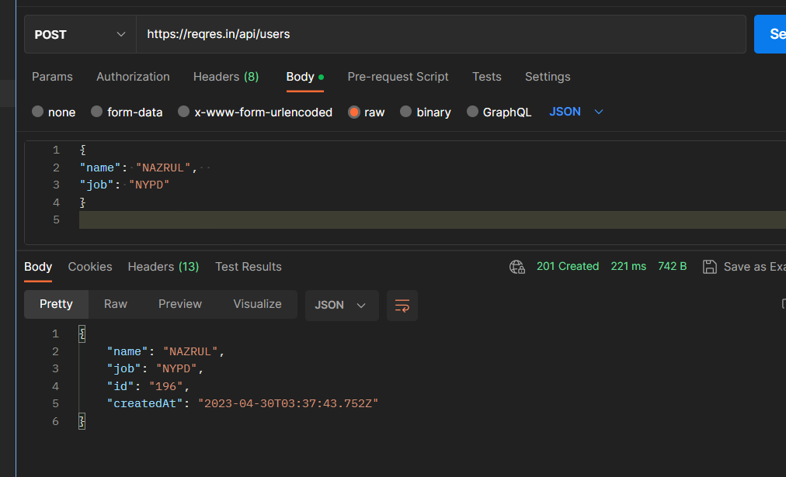
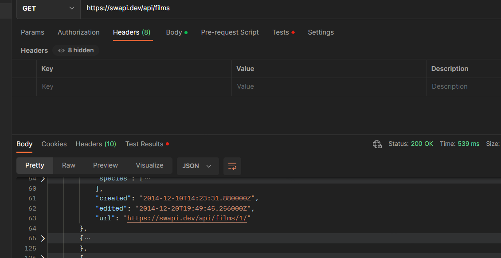
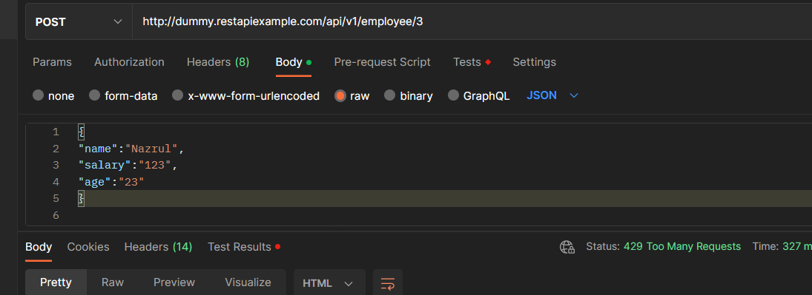
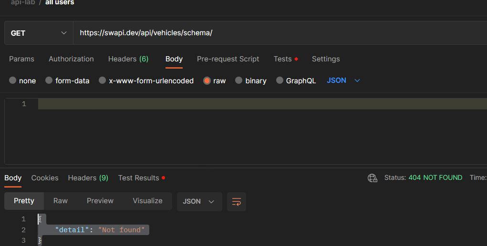

                                                              API-Assignment

1.Make API calls using the following URIs and record the status code and response body for each API call (You will write the answer after every question and any screen capture in this document)
Get authentication token using URI: https://postman-echo.com/basic-auth

How did you get the response?
Postman sent a GET request to the postman Echo API server located at the postman-echo.com and the API server received the request and returned with a response in the postman.

2.Get information about all users using URI: https://reqres.in/api/users 
Question:
How many lists can you see in the response body? 
>**1**

3.Get information about the user with id 3 using URI: https://reqres.in/api/users/3 
Question:
How many lists can you see in the response body? > NO LIST
What are the available property(Key) names in the response body?
>there are two primary keys 

4.Delete the User with id 9 using URI https://reqres.in/api/users/9 
Question: 
What is the response? 
> Response 1 Status code 204.
> the server not allowing to delete

How many users are now on the users list? https://reqres.in/api/users 
Can you see the deleted user record? 
>yes as i could not delete !

5.Get information of the user with id 40 using URI: https://reqres.in/api/users/40 
Question:
How many lists can you see in the response body? 
>NO LIST

What are the available property(Key) names in the response body?
> NO PROPERTY THERE

6.Create a new user in a system using URI: https://reqres.in/api/users  Verb: POST Request Body:
{
"name": "yourname",  
"job": "dreamjob"
}  

Question:
What is the response code? 
> > 201 CREATED
> 
What are the available property(Key) names in the response body?  
>"name","job","id","createdAt"

What is the value of response Header Etag? 
> W/"54-osKxtFHIFDl7O9X/DuXKwxs087g"

7.Sign in to the system using URI: https://reqres.in/api/login and {"email": "peter@klaven"}

Question:
What is the response code? 
>400 bad request

8.Sign in to the system using URI: https://reqres.in/api/login and
{
"email": "eve.holt@reqres.in",
"password": "cityslicka"
}

Question:
What is the value of response Header Etag? 
> W/"1d-lGCrvD6B7Qzk11+2C98+nGhhuec"

What is the response?  
>  "token": "QpwL5tke4Pnpja7X4"

9.Get information about all planets using URI: https://swapi.dev/api/planets. Carefully observe the response body and make a list of all attributes and write their data types.
Question:

How many lists can you see in the response body? 
>Primarily one list named "Results" under that more lists available

10.Get information about the third planet using URI: https://swapi.dev/api/planets/3/
Question: 

How many properties you can see in response body? 
11.Get information about all the starships using URI: https://swapi.dev/api/starships. 

Carefully observe the response body and make a list of all attributes and write their data types.
Question:
How many lists can you see in the response body? 
>1

12.Get information about the ninth starship using URI: https://swapi.dev/api/starships/9/ 

Question:
How many lists can you see in the response body? 
>2 

13.Get information about all films using URI: https://swapi.dev/api/films.

Carefully observe the response body and make a list of all attributes and write their data types.
Question:
How many lists can you see in the response body? 
>One list

14.Get information about the third planet using URI: https://swapi.dev/api/species 

Question:
How many lists can you see in the response body?
>1

15.Get all booking ids using URI: https://restful-booker.herokuapp.com/booking

Question:
How many lists can you see in the response body? 
>1

16.Get details about booking id 23 using URI: https://restful-booker.herokuapp.com/booking/23
Question:
What is the response? 
17.Get details about booking id 3 using URI: https://restful-booker.herokuapp.com/booking/3

Question: 
What is the response? 
18.Get information about all planets using URI: https://swapi.dev/api/planets
Question:
What is the response?

How many lists can you see in the response body? 
>There is One primary list called "results" and under the every object there are two Lists.

19.Get information about all species using URI: https://swapi.dev/api/species. Carefully observe the response body and make a list of all attributes and write their data types.
Question:
How many lists can you see in the response body? One primary List but there all together 20 other lists 
What is the response? 

20.Write JSON path for following JSON file:
{
"studio": {
"movie": [
{
"category": "history",
"director": "John",
"title": "History",
"rating": 6.60
},
{
"category": "comedy",
"director": "Paul",
"title": "Laugh",
"rating": 4.00
},
{
"category": "fiction",
"director": "Jack",
"title": "Wake",
"isbn": "87877676879",
"rating": 8.01
},
{
"category": "drama",
"director": "Edward",
"title": "Wuthering Heights",
"isbn": "8754543578",
"rating": 4.50
}
],
"music": {
"song": "pale",
"rate": 5.4
}
},
"ranking": 20
}
a. To retrieve all direct properties of the studio object .studio
b. To find out the music’s song .studio.music
c. To find the rating of all items in the studio: .studio.movie[0].rating, .studio.movie[1].rating, .studio.movie[2].rating, .studio.movie[3].rating
d. To retrieve information on all movies: .studio.movie[0],.studio.movie[1], .studio.movie[2], .studio.movie[3], 
e. To find out the titles of all movies: .studio.movie[0].title, .studio.movie[1].title, .studio.movie[2].title, .studio.movie[3].title
f. To retrieve the titles of all movies by Jack: .studio.movie[2].director
g. To retrieve the category of the last movie: .studio.movie[3].category
i. To retrieve all movies that have the isbn property: .studio.movie[2].isbn, .studio.movie[3].isbn

21.Get information about all employess using URI: http://dummy.restapiexample.com/api/v1/employees
Question:
How many lists can you see in the response body?  
>ONE

What is the response?

What are the available property(Key) names in the response body?
>"status"
"data"
"id"
"employee_name"
"employee_salary"
"employee_age"
"profile_image"

Make a list of all attributes and write the data types. 
>"status"-String
"data"-List
"id" -Number
"employee_name" String
"employee_salary"- number
"employee_age"- number
"profile_image" string
> 
22.Get a single employee data using URI: http://dummy.restapiexample.com/api/v1/employee/3

Question:
How many data you can see in response body? 
> 8 data with String and number data types
>
What is the response status? 
>200 ok 

23.Create a new employee in a system by using URI: http://dummy.restapiexample.com/api/v1/create Verb: POST Request Body:
{
"name":"your name",
"salary":"123",
"age":"23"
}

Question:
What is the response? 
can you see "id" property in the response? if Yes, note the "id" value. 
> response code 429 too many requests

24.Delete an employee record whose employee id in 2 by using URI http://dummy.restapiexample.com/api/v1/delete/2
Question:
What is the response? 
How many employees are now in the employees list? http://dummy.restapiexample.com/api/v1/employees 
> >24
> 
Can you see the deleted employee record? 
> >yes
> 
25.Register a user by using
URI: https://reqres.in/api/register Verb: POST Request Body:
{
"email": "john.jack@example.com",
"password": "@izaanSchool"
}

Question:
What is the response? 

What are the available property(Key) names in the response body? nothing shows up
26.Get an user Using URL https://reqres.in/api/unknown/2
Question:
What is the response? 
27.A simple health check endpoint to confirm whether the API is up and running using https://restful-booker.herokuapp.com/ping 

Question:
What is the response? 
>created
> 
28.Get information using Delayed Response using URI: https://reqres.in/api/users?delay=3

Question:
What is the response? 
How many seconds delay to respond? 
>3.23s
> 
29.Get information about vehicles using URL https://swapi.dev/api/vehicles/schema/

Question:
What type of response it is? 
> >Error
> 
What is response status code? 
> >404NOT FOUND
> 
30.Get information about starships using URL https://swapi.dev/api/starships/schema/

Question:
What type of response it is? 
> >error
> 
Write down the response status code.
> >404NOT FOUND
> 
What are the available property(Key) names in the response body? 
> >No properties there

